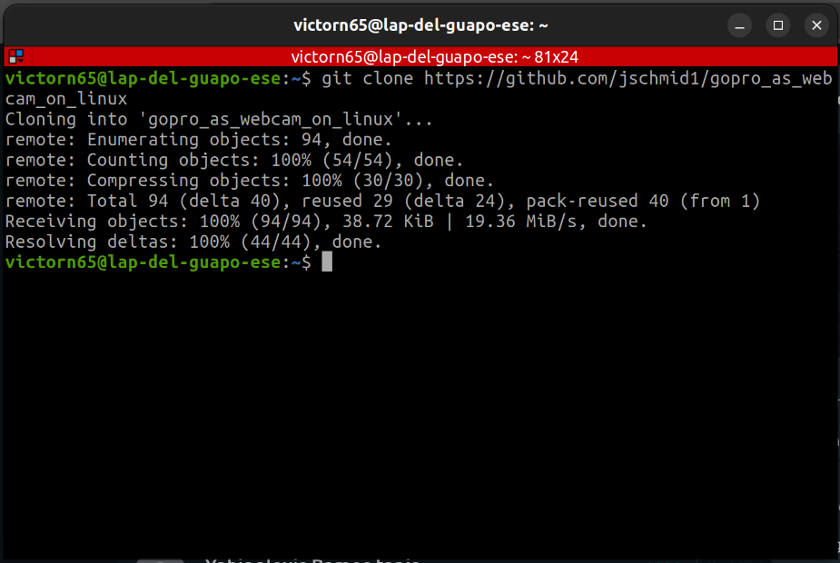
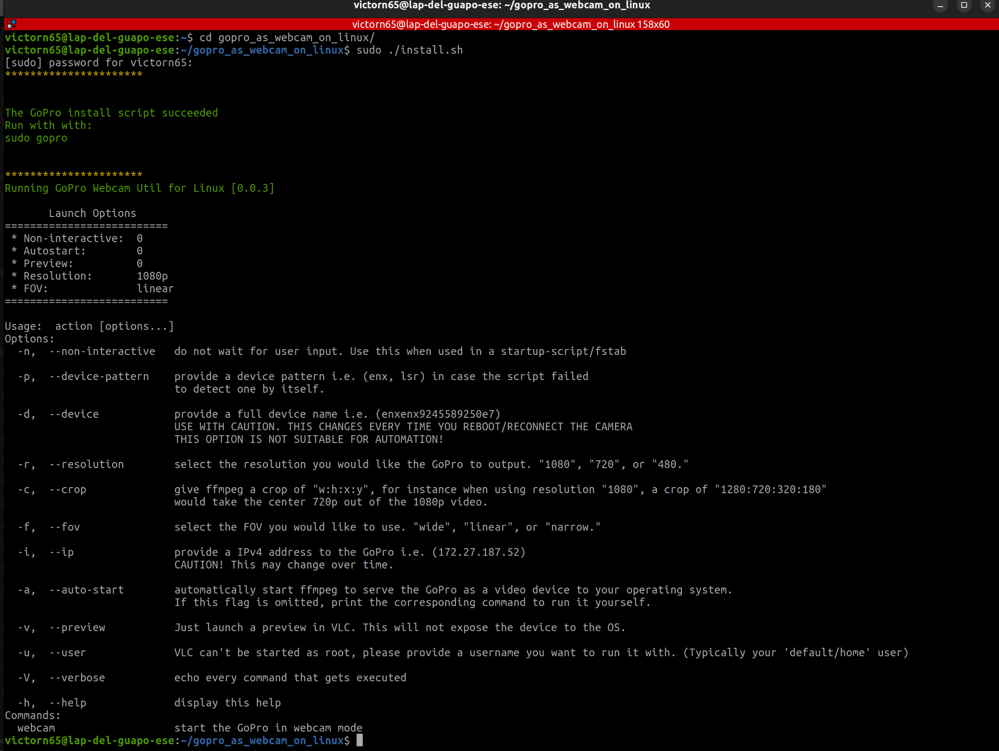
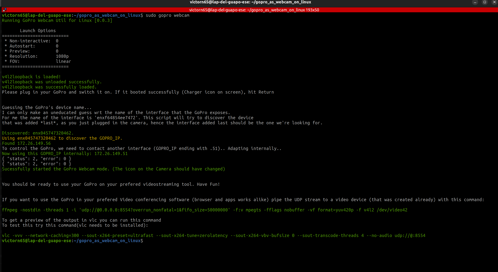
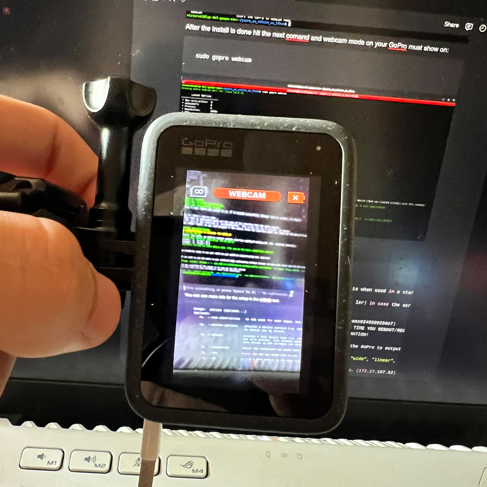

# Setup your GoPro Camera

### 1. Download the github repository

`git clone https://github.com/jschmid1/gopro_as_webcam_on_linux`

### 2. Enter the directory and copy:
`sudo ./install.sh`

### 3. Enable webcam mode on your GoPro, the camera must be pluged in:

`sudo gopro webcam`

### You should see an output like this:

## With that you are able to run our code (camera.py) with your GoPro and model
For more information about how to use your GoPro with linux check the repository:

https://github.com/jschmid1/gopro_as_webcam_on_linux